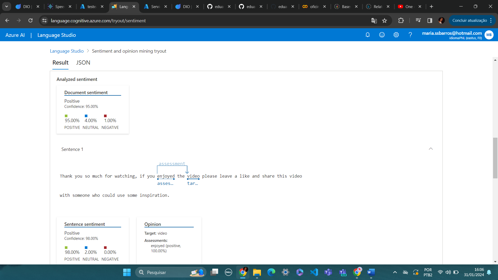
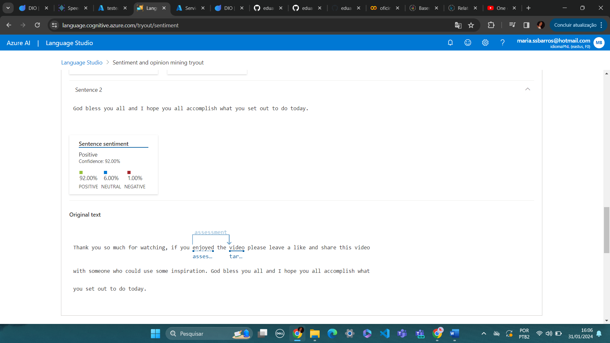

# Processamento de Linguagem Natural para análise de sentimentos em texto - Azure Language

## Análise do primeiro texto:

Figura 1: representa o trecho de comentário em um vídeo na rede social do Youtube.

No texto da primeira imagem, aplicado primeiramente para o idioma inglês, reconhece palavras positivas como "enjoyed" e
o seu relacionamento com o contexto inserido em "video".

Figura 2: representa a continuação da análise do trecho de comentário em um vídeo na rede social Youtube.

Como continuidade da primeira imagem, nesse trecho do texto a inteligência artificial reconhece 92% de sentenças positivas.
Portanto, classifica o texto como majoritariamente positivo.

## Análise do segundo texto:
