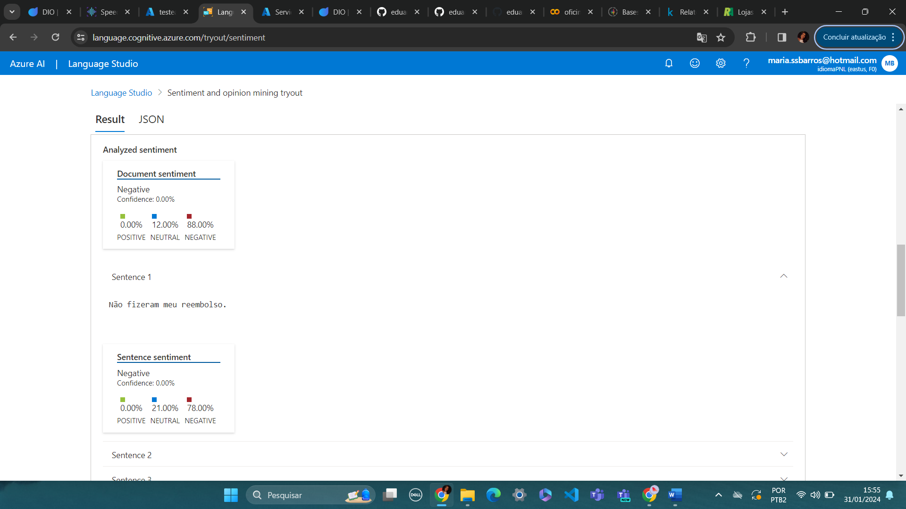

# Processamento de Linguagem Natural para análise de sentimentos em texto - Azure Language

## Análise do primeiro texto:

Figura 1: representa o trecho de comentário em um vídeo na rede social do Youtube.

No texto da primeira imagem, aplicado primeiramente para o idioma inglês, reconhece palavras positivas como "enjoyed" e
o seu relacionamento com o contexto inserido em "video".

Figura 2: representa a continuação da análise do trecho de comentário em um vídeo na rede social Youtube.

Como continuidade da primeira imagem, nesse trecho do texto a inteligência artificial reconhece 92% de sentenças positivas.
Portanto, classifica o texto como majoritariamente positivo.

## Análise do segundo texto:

Figura 3: reconhece 99% de conteúdo positivo no trecho de texto em português.

Figura 4: relaciona o sentimento ou opinião, a partir da palavra "maravilhosa", com o contexto envolvido "playlist".

## Análise do terceiro texto:

Figura 4: identifica o caráter negativo da primeira sentença.

Figura 5: reconhece neutralidade na última sentença, apesar do conteúdo do texto, de forma geral, ser majoritariamente negativo.

